# Alibaba Cloud MaxCompute SQL Quiz Compilation

## Single Answer

1. Which of the following statements about ORDER BY and DISTRIBUTE BY/SORT BY is incorrect in the MaxCompute SQL syntax?

	A. The keys of ORDER BY/SORT BY/DISTRIBUTE BY must be output columns (namely, column aliases) of SELECT statements.  
	B. ORDER BY or GROUP BY cannot be used together with DISTRIBUTE BY.  
	C. When ORDER BY is used for sorting, NULL is considered to be zero.  
	D. DISTRIBUTE BY performs hash-based sharding on data by values of certain columns. Aliases of SELECT output columns must be used.

	[Explaination:](https://www.alibabacloud.com/help/en/maxcompute/user-guide/select-syntax?spm=a2c63.p38356.0.0.15f0233b5HjKct#section-49m-ve3-2su)

	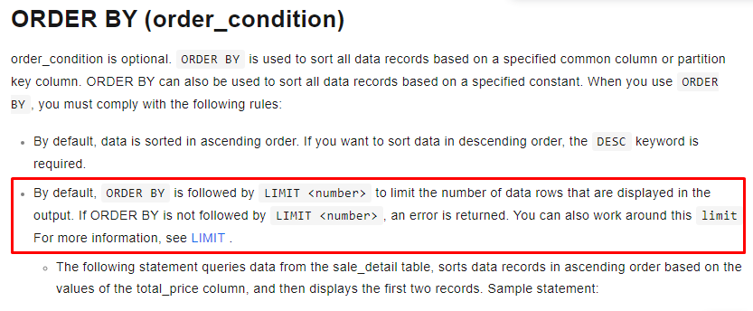

	**Answer : C**

2. Which statement of the table life cycle is incorrect?

	A. The unit of the life cycle time of a table is day.  
	B. The data of the non-partition table will be automatically recycled after setting the day number of life cycle.  
	C. We can set the lifecycle of tables or partitions.  
	D. The partition table determines whether the partition should be recycled according to the last modification time of each partition.

	[Explaination:](https://www.alibabacloud.com/help/en/maxcompute/product-overview/lifecycle)

	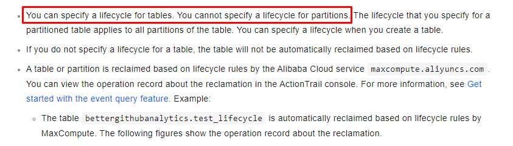

	**Answer : C**

3. Currently, MaxCompute supports specifying up to 6 small tables in a mapjoin. Otherwise, syntax errors are reported, and records for a single small table are limited to no more than 10,000.

	A. True  
	B. False

	[Explaination:](https://www.alibabacloud.com/help/en/maxcompute/product-overview/limits-4?spm=a2c63.p38356.0.0.30db1977jsoGbO)

	

	**Answer : B**

4. MaxCompute SQL supports multiple data types. Which group is incorrect?

	A. Tinyint, Smallint, Int, Float, Varchar  
	B. Bigint, String, Double, Boolean, Decimal, Smallint  
	C. Bigint, String, Double, Datetime, Link, Decimal  
	D. Tinyint, Smallint, Float, Varchar, TIMESTAMP

	[Explaination:](https://www.alibabacloud.com/help/en/maxcompute/user-guide/maxcompute-v2-0-data-type-edition?spm=a2c63.p38356.0.0.408d4194TKeaMV)

	**Answer : C**

5. Which logical operation is incorrect in MaxCompute SQL?

	A. NULL AND FALSE = FALSE  
	B. NULL AND TRUE = NULL  
	C. FALSE OR TRUE = TRUE  
	D. TRUE OR NULL = TRUE

	[Explaination:](https://www.alibabacloud.com/help/en/maxcompute/user-guide/operator?spm=a2c63.p38356.0.0.5d194194w56VNO#section-6r3-8ij-rx0)

	**Answer = No answer (all operation is correct)**

6. When you use MapJoin, which one is incorrect?

	A. The left table of a 'left outer join' must be a big table.  
	B. The right table of a 'right outer join' must be a big table.  
	C. For INNER JOIN, both the left and right tables can be large tables.  
	D. For FULL OUTER JOIN, MapJoin can be used.

	[Explaination:](https://www.alibabacloud.com/help/en/maxcompute/user-guide/mapjoin-hints#section-kbq-r46-ef5)

	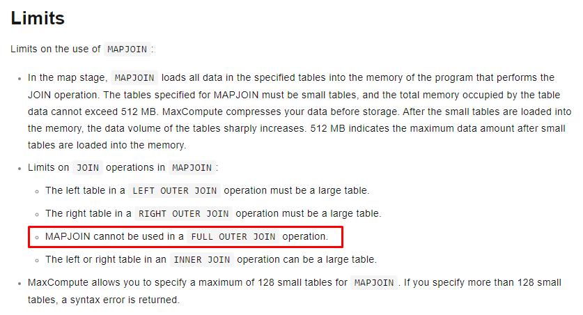

	**Answer : D**

7. Which description of SELECT in MaxCompute SQL is incorrect?

	A. When using SELECT to read data from the table, specify the names of the columns to be read, or use an asterisk (\*) to represent all columns.  
	B. When MaxCompute SQL does parsing, ORDER BY/SORT BY/DISTRIBUTE BY are in front of SELECT.  
	C. The WHERE clause of MaxCompute SQL supports BETWEEN...AND conditional query.  
	D. If duplicated data rows exist, you can use the DISTINCT option before the field to remove duplicates. In this case, only one value is returned.

	[Explaination:](https://www.alibabacloud.com/help/en/maxcompute/user-guide/select-syntax#section-dcq-y11-hfb)

	ORDER BY/SORT BY/DISTRIBUTE BY are behind SELECT clause

	**Answer : B**

8. Which statement is incorrect when updating data by MaxCompute SQL?

	A. When performing insert operations, the correspondence between the source table and the target table depends on the columns order in the select clause, not on the correspondence between the column names of the tables.  
	B. The value of dynamic partition cannot be NULL, but it supports special or Chinese characters.  
	C. Partitioned columns are not allowed to appear in the select column list when data is inserted into a partition.  
	D. In the select statement field, the following field provides a dynamic partition value for the target table. If the target table has only one-level dynamic partition, the last field value of the select statement is the dynamic partition value of the target table.

	[Explaination:](https://www.alibabacloud.com/help/en/maxcompute/user-guide/insert-or-overwrite-data-into-dynamic-partitions#section-1nx-q2d-xga)
	
	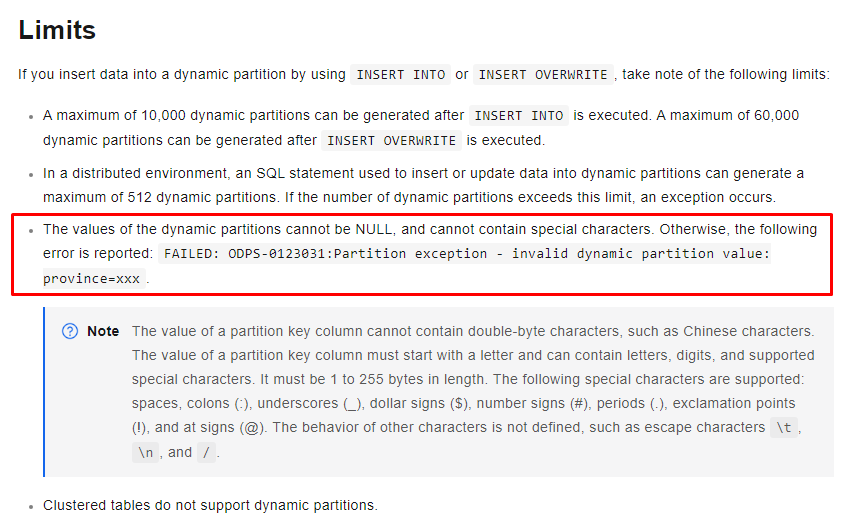

	**Answer : B**

9. During MaxCompute SQL parsing, ORDER BY/SORT BY/DISTRIBUTE BY is behind the SELECT operation.

	A. True  
	B. False

	[Explaination:](https://www.alibabacloud.com/help/en/maxcompute/user-guide/select-syntax#section-dcq-y11-hfb)

	**Answer : A**

10. Data type inconsistency is often encountered in business data processing. In order to keep data type consistent, data processing systems involve data type conversion. If MaxCompute SQL is used for data processing, which of the following conversions cannot be achieved?

	A. Bigint to String  
	B. String to Boolean  
	C. String to Bigint  
	D. Datetime to String

	Explaination:

	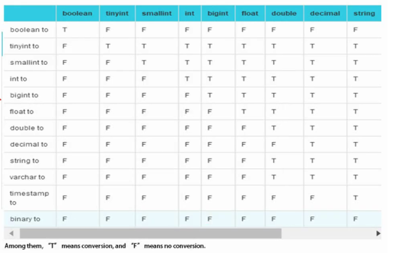

	**Answer : B**

11. When you have multiple tables join, it only allows one leftmost table to be a mapjoin table.

	A. True  
	B. False

	Explaination:
	
	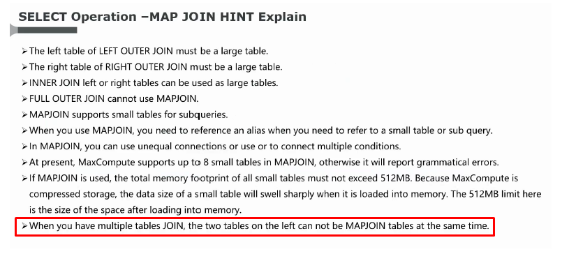

	**Answer : A**

12. Which statement is incorrect for the dynamic partition in MaxCompute SQL?

	A. If the destination table has multi-level partitions, it is allowed to specify parts of partitions to be static partitions through the INSERT statement, but the static partitions must be advanced partitions.  
	B. The value of dynamic partition can be special characters.  
	C. In the select statement field, the following field provides a dynamic partition value for the target table. If the target table has only one-level dynamic partition, the last field value of the select statement is the dynamic partition value of the target table.  
	D. The value of dynamic partition cannot be NULL.

	[Explaination:](https://www.alibabacloud.com/help/en/maxcompute/user-guide/insert-or-overwrite-data-into-dynamic-partitions#section-1nx-q2d-xga)
	
	

	**Answer : B**

13. MaxCompute SQL syntax does not support BETWEEN conditional queries.

	A. True  
	B. False

	[Explaination:](https://www.alibabacloud.com/help/en/maxcompute/user-guide/select-syntax#section-lwx-cv2-ggb)

	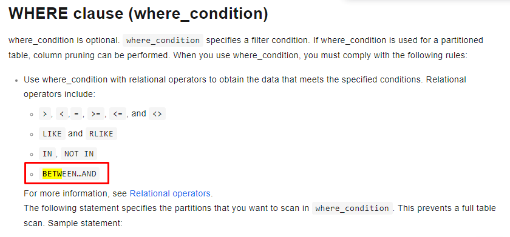

	**Answer : B**

14. Which of the following MaxCompute SQL syntax is incorrect?

	A. SELECT a.shop_name AS ashop, b.shop_name AS bshop FROM shop a RIGHT OUTER JOIN sale_detail b ON a.shop_name = b.shop_name;  
	B. SELECT a.shop_name AS ashop, b.shop_name AS bshop FROM shop a FULL OUTER JOIN sale_detail b ON a.shop_name = b.shop_name;  
	C. SELECT * FROM table1, table2 WHERE table1.id = table2.id;  
	D. SELECT a.shop_name AS ashop, b.shop_name AS bshop FROM shop a INNER JOIN sale_detail b;

	Explaination: Missing ON statement

	**Answer : D?**

15. Which statement is incorrect for view in MaxCompute SQL?

	A. To create a view, you must have 'read' privilege on the table referenced by view.  
	B. Other views can be referenced by a view. Circular reference is supported.  
	C. Views can only contain one valid 'select' statement.  
	D. Writing the data into a view is not allowed, such as, using 'insert into' or 'insert overwrite' to operate view
	
	Explaination:

	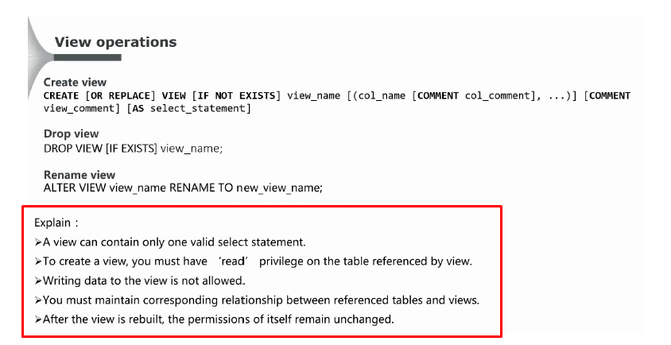

	**Answer : B**

16. The source and pattern parameters of LIKE and RLIKE must be string types or integer.

	A. True  
	B. False
	
	Explaination: Only string 

	**Answer : B**

17. Which statement is incorrect for partition in MaxCompute SQL?

	A. To modify values in one or more partitions among multi-level partitions, users must write values for partitions at each level.  
	B. We cannot specify order for a new column. By default, a new column is placed in the last column.  
	C. The name of a partition column can be modified.  
	D. For tables that have multi-level partitions, to add a new partition, all partition values must be specified.

	[Explaination:](https://www.alibabacloud.com/help/en/maxcompute/user-guide/partition-and-column-operations-1#section-lrr-ycb-wdb)

	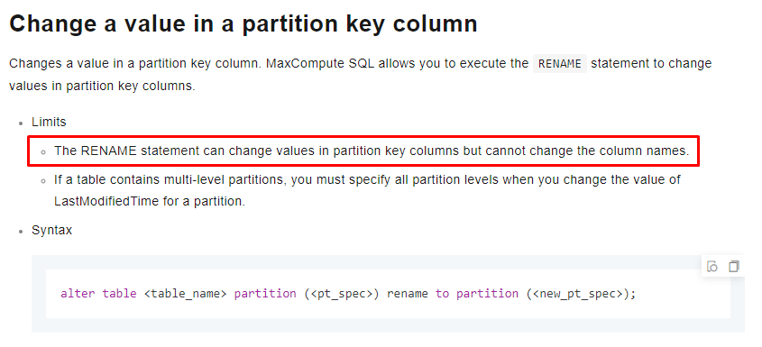

	**Answer : C**

18. Which calculation is incorrect in MaxCompute SQL?

	A. If A or B is NULL, A+B returns NULL; otherwise, returns A + B.  
	B. If A or B is NULL, A\*B returns NULL; otherwise, returns A * B.  
	C. axb like a%b = TRUE  
	D. A % B: If A or B is NULL, return NULL; otherwise, return the result of A mod B.

	[Explaination:](https://www.alibabacloud.com/help/en/maxcompute/user-guide/operator?spm=a2c63.p38356.0.0.201b23b5MM2Dd7#section-ycc-chl-vdb)

	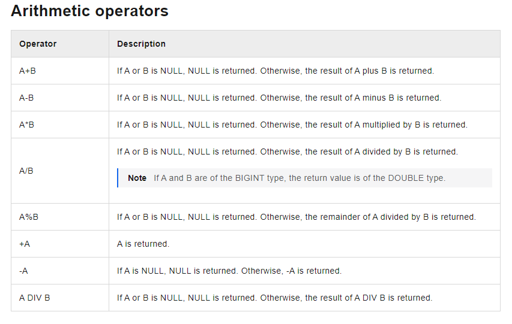
	
	**Answer : C**

19. MaxCompute SQL uses a syntax similar to SQL. Which statement is correct?

	A. MaxCompute SQL extended standard SQL  
	B. MaxCompute can be equivalent to a database.  
	C. The maximum SQL length allowed in MaxCompute varies with the environment resources that are applied.  
	D. MaxCompute SQL is suitable for massive data (GB, TB, EB level), off-line batch calculation scenarios.

	Explaination:

	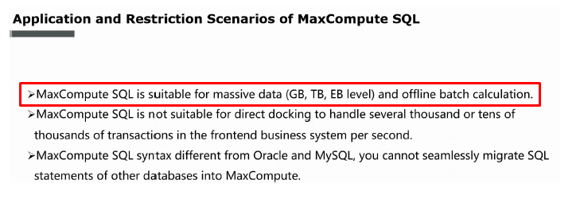

	**Answer : D**

20. Suppose table t_dml only has one field named id (type is string). Which MaxCompute SQL query cannot be executed correctly?
	
	A. CREATE TABLE t_dml_bak LIKE t_dml;  
	B. INSERT INTO TABLE t_dml SELECT '1900-01-01 00:00:00' FROM dual;  
	C. INSERT OVERWRITE TABLE t_dml SELECT * FROM dual;  
	D. UPDATE TABLE t_dml SET id='a';

	**Answer : D**

## Multiple Answer

1. Which of the following descriptions about the MaxCompute SQL constraint conditions are correct?

	A. MaxCompute SQL does not support transactions.  
	B. MaxCompute SQL does not support indexes.  
	C. MaxCompute SQL supports delete operations.  
	D. MaxCompute SQL does not support update operations.

	Explaination:

	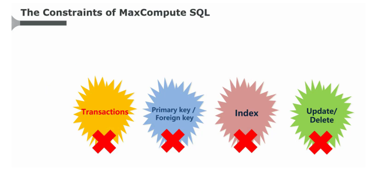

	**Answer : A, B & D**

2. Which of the following statements of mapjoin Hint application of MaxCompute SQL are correct?

	A. When a large table joins one or multiple small tables, you can use MapJoin, which performs much faster than regular joins.  
	B. When MapJoin references to a small table or subquery, alias should be referenced.  
	C. MaxCompute SQL does not support the use of complex Join conditions such as unequal expressions, or logic in normal Join's on condition, but in MapJoin it can.  
	D. When doing multiple table joins, the two left tables can be MapJoin tables at the same time.
	
	[Explaination:](https://www.alibabacloud.com/help/en/maxcompute/user-guide/mapjoin-hints?spm=a2c63.p38356.0.0.6ea648e0e9ht84)

	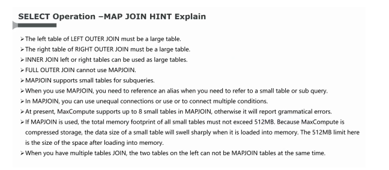

	**Answer : A, B, C**

3. Which of the following MaxCompute SQL syntax statements are correct?

	A. JOIN of MaxCompute supports n-way join, but it must be a non-Cartesian product.  
	B. The indirect expression of MaxCompute's JOIN must be an equation expression.  
	C. When mapjoin references to a small table or subquery, alias should be referenced, otherwise it will report syntax errors.  
	D. Right outer join returns all records in the right table, even if there is no matched record in the left table.

	**Answer : B, C & D ?**

4. Which UNION ALL statements in MaxCompute SQL are correct?

	A. Combines two or multiple data sets returned by a SELECT operation into one data set. If the result contains duplicated rows, all rows that meet the conditions are returned, and deduplication of duplicated rows is not applied.  
	B. MaxCompute does not support union two main query results, but you can do it on two subquery results.  
	C. The columns of each subquery corresponding to the UNION ALL operation must be listed, not supporting \*.  
	D. The number, names, and types of queried columns corresponding to the UNION ALL/UNION operation must be consistent.

	**Answer : A, B & D ?**

5. Which JOIN operations in MaxCompute SQL are correct?

	A. MaxCompute's JOIN supports multiple links, and it also supports Cartesian product.  
	B. Left join returns all records from the left table.  
	C. Right outer join returns all records from the right table.  
	D. Full outer join indicates the full join and returns all records from both the left and right tables.

	[Explaination:](https://www.alibabacloud.com/help/en/maxcompute/user-guide/join)

	**Answer : B, C & D**

6. MaxCompute SQL provides the EXPLAIN operation. What does the execution result include?

	A. All resource structures corresponding to the DML sentence.  
	B. The dependency structure of all Tasks corresponding to the DML sentence.  
	C. The dependency structure of all Operators in a Task.  
	D. The dependency structure of all Tasks in a Task.

	**Answer : A, B & C?**

7. Which of the following limitations in MaxCompute SQL are correct?

	A. Table name length  
	B. Table column definition  
	C. Table partition level and single table partition number  
	D. Window function number  
	E. Table name and field definition case
	
	[Explaination:](https://www.alibabacloud.com/help/en/maxcompute/user-guide/maxcompute-sql-limits)

	**Answer : A, B & C**

8. Which of the following statements are correct?

	A. "ORDER BY" must be used together with "LIMIT".  
	B. When sorting with "ORDER BY", NULL is considered smaller than any value.  
	C. DISTRIBUTE BY is to make hash slices of data according to the values of a certain column. It is similar to GROUP BY.  
	D. SORT BY and ORDER BY are all used for sorting in essence, the difference is that the scope is not the same.  
	E. The key of ORDER BY or SORT BY must be the output column of the SELECT sentences, that is, the alias of the column.
	
	**Answer : A, C, D & E ?**

9. Group by is for group query in MaxCompute SQL. Which of the following queries of Group by are correct?

	A. Generally "group by" and aggregate functions are used together.  
	B. The key of "group by" can be the column name of the input table.  
	C. When SELECT contains aggregate functions, "group by" can be an expression consisting of columns of input tables.  
	D. When SELECT contains aggregate functions, "group by" can be the alias of the output column of the SELECT statement.
	
	**Answer : A, B & C ?**

10. Which of the following queries can be executed?

	A. SELECT SUM(total_price) FROM sale_detail GROUP BY region;  
	B. SELECT region AS r FROM sale_detail GROUP BY r;  
	C. SELECT region, total_price FROM sale_detail GROUP BY region, total_price;  
	D. SELECT region AS r FROM sale_detail ORDER BY region LIMIT 100;  
	E. SELECT region AS r FROM sale_detail DISTRIBUTE BY region;
	
	**Answer : C, D & E ?**
