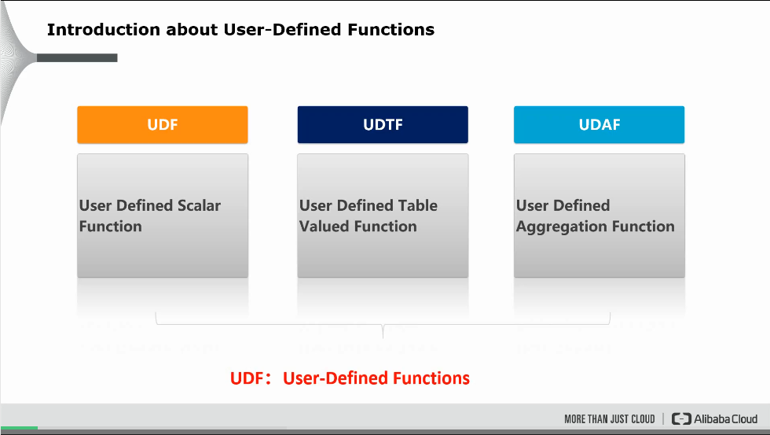
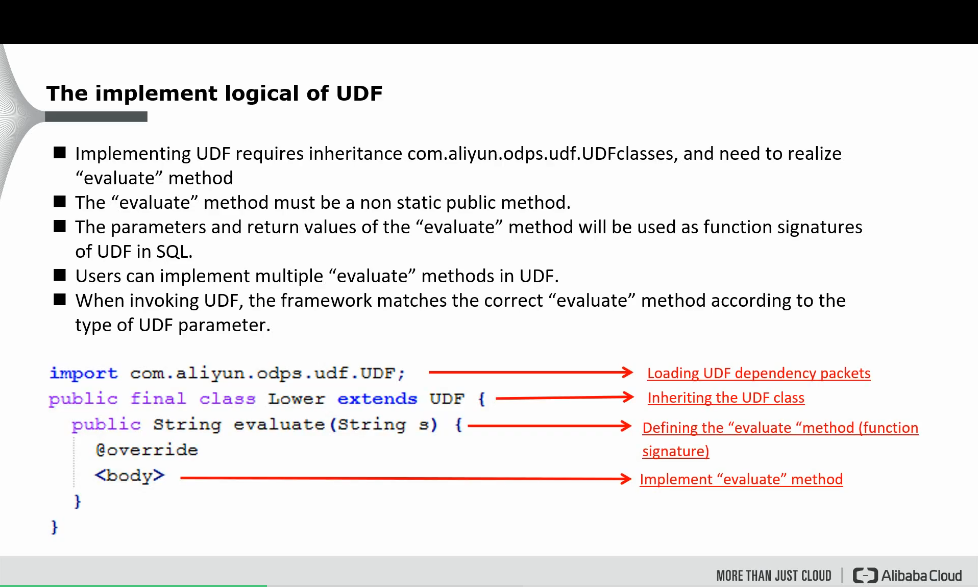
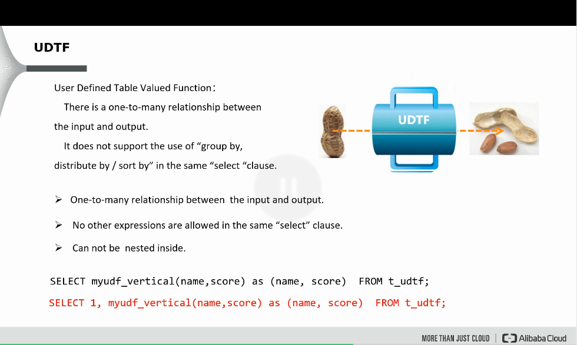
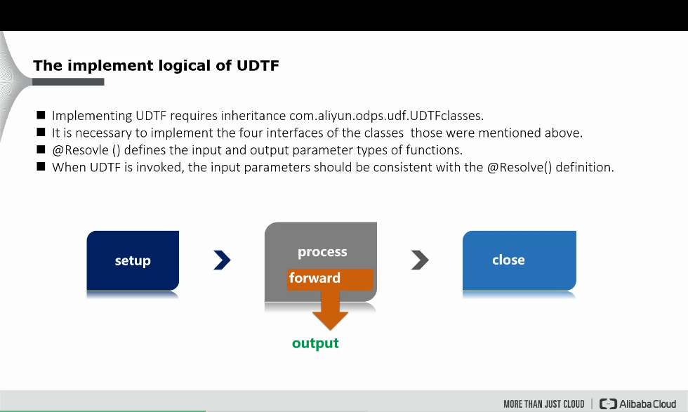
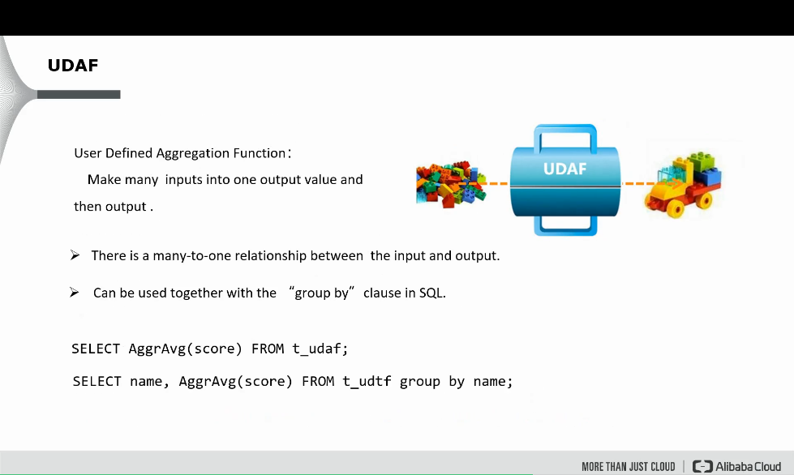
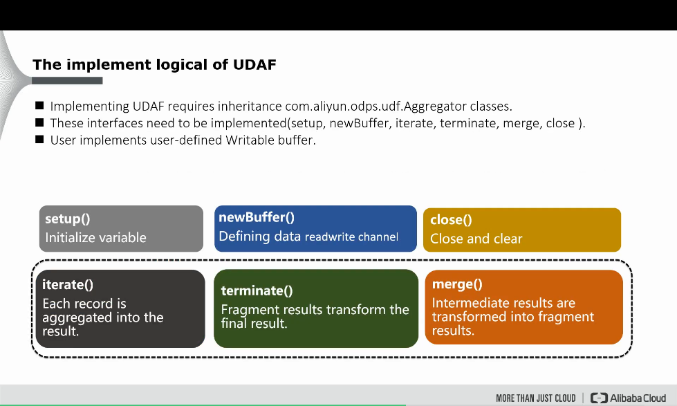
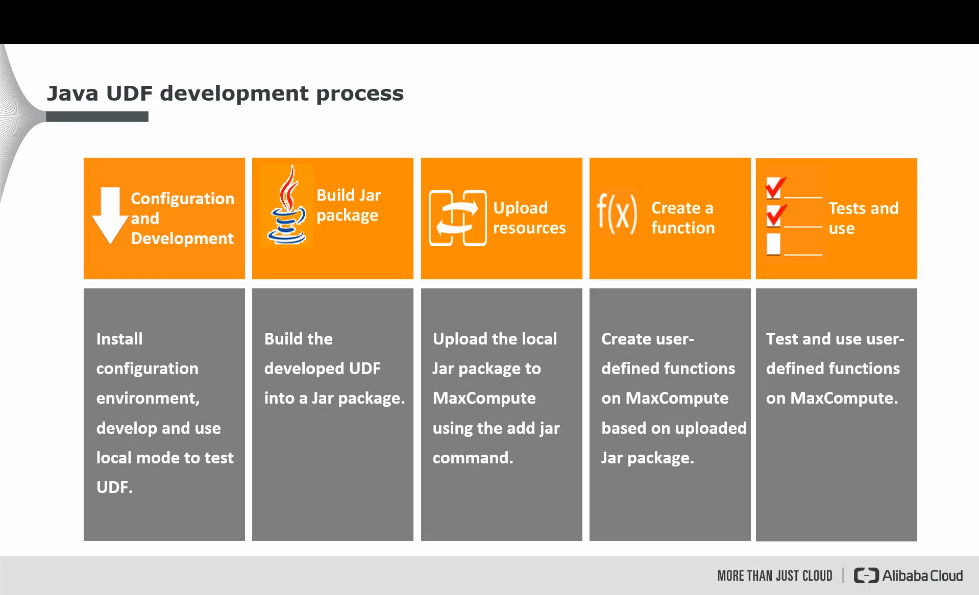
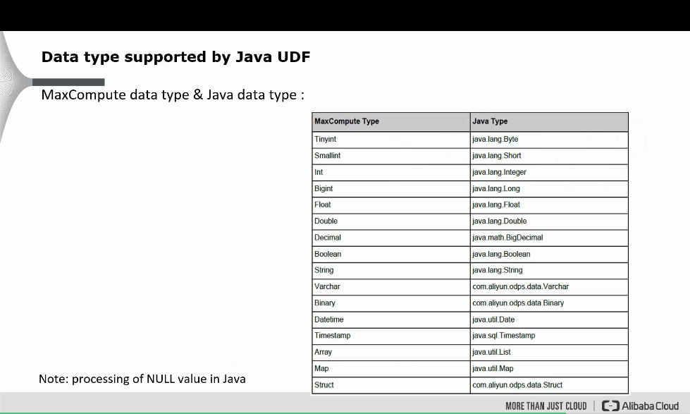

# UDF

MaxCompute provides various built-in functions to meet your business requirements. If the built-in functions of MaxCompute do not meet your business requirements, you can write code to create user-defined functions (UDFs) based on the development process and examples that are described in this topic.

## Background information UDF



In the broad sense, UDFs include user-defined scalar functions, user-defined aggregate functions (UDAFs), and user-defined table-valued functions (UDTFs). In the narrow sense, UDFs refer only to user-defined scalar functions. The following table describes the types of MaxCompute UDFs.

|Type|Scenario|
|----|--------|
|UDF|This type of UDFs is applicable to scenarios in which the input data and output data are in a one-to-one mapping relationship. A one-to-one mapping is established between the input and output data of a UDF. Each time a UDF reads a row of data, it returns an output value.|
|UDTF|This type of UDFs is applicable to scenarios in which the input data and output data are in a one-to-many mapping relationship. A one-to-many mapping is established between the input and output data of a UDTF. Each time a UDTF reads a row of data, it returns multiple values, which are considered a table.|
|UDAF|A many-to-one mapping is established between the input and output data of a UDAF. Multiple input records are aggregated to generate one output value.|

## Limits UDF

1. Access the Internet by using UDFs

2. Access a VPC by using UDFs

3. Read table data by using UDFs, UDAFs, or UDTFs

	You cannot use UDFs, UDAFs, or UDTFs to read data from the following types of tables:
	
	*   Table on which schema evolution is performed
	*   Table that contains complex data types
	*   Table that contains JSON data types
	*   Transactional table
	
## Precautions UDF

Before you use UDFs, take note of the following items:

1. UDFs cannot compete with built-in functions in performance. We recommend that you preferentially use built-in functions to implement your business logic.

2. When you use a UDF in SQL statements, the memory usage of a computing job may exceed the default allocated memory size if a large amount of data is computed and data skew occurs. In this case, you can run the set odps.sql.udf.joiner.jvm.memory=xxxx; command at the session level to resolve the issue. For more information about UDFs, see [FAQ about MaxCompute UDFs](https://www.alibabacloud.com/help/en/maxcompute/user-guide/faq-about-maxcompute-udfs/#concept-2113685).

3. If the name of a UDF is the same as that of a built-in function, the UDF is preferentially called. For example, if UDF CONCAT and built-in function CONCAT both exist in MaxCompute, the system automatically calls UDF CONCAT instead of the built-in function CONCAT. If you want to call the built-in function, you must add the symbol :: before the built-in function. For example, you can use select ::concat('ab', 'c');

## Usage notes UDF

Before you write a Java UDF, you must understand the UDF code structure and the mappings between the data types used by Java UDFs and the data types supported by MaxCompute. For more information about the data type mappings, see Appendix: Data types.

Before you write a Java UDF, take note of the following points:

1. We recommend that the JAR files of different UDFs do not contain the classes that have the same name but different logic. For example, the JAR file of UDF 1 is named udf1.jar and the JAR file of UDF 2 is named udf2.jar. Both files contain a class named com.aliyun.UserFunction.class, but the class has different logic in the files. If UDF 1 and UDF 2 are called in the same SQL statement, MaxCompute loads the com.aliyun.UserFunction.class from one of the two files. As result, the UDFs cannot run as expected and a compilation error may occur.

2. The data types of the input parameters or return value of a Java UDF are objects. The first letters of these data types must be capitalized, such as String.

3. NULL values in MaxCompute SQL are represented by NULL in Java. Primitive data types in Java cannot represent NULL values in MaxCompute SQL. Therefore, these data types cannot be used.

## Implement logical UDF



## Code structure UDF

You can write UDF code in Java. The code must contain the following information:

* Java package: optional. 

	You can package Java classes that are defined into a JAR file for future use.

* Base UDF class: required.

	The required UDF class is com.aliyun.odps.udf.UDF. If you want to use other UDF classes or complex data types, follow the instructions provided in [Overview](https://www.alibabacloud.com/help/en/maxcompute/user-guide/overview-22#section-oq4-vts-wjh) to add the required classes. For example, the UDF class that corresponds to the STRUCT data type is com.aliyun.odps.data.Struct.

* `@Resolve` annotation: optional.

	The annotation is in the `@Resolve`(<signature>) format. The signature parameter is used to define the data types of the input parameters and return value of a UDF. If you want to use data of the STRUCT data type in a UDF, you cannot use the reflection feature for the com.aliyun.odps.data.Struct class to obtain the names and types of fields. In this case, you must add the `@Resolve` annotation to the com.aliyun.odps.data.Struct class. This annotation affects only the overloading of the UDF whose input parameters or return value contain the com.aliyun.odps.data.Struct class. Example: `@Resolve`("struct<a:string>,string->string"). For more information about how to use complex data types in Java UDFs, see [Use complex data types in Java UDFs](https://www.alibabacloud.com/help/en/maxcompute/user-guide/use-complex-data-types-in-java-udfs#task-2107459).

* Custom Java class: required.

	A custom Java class is the organizational unit of UDF code. This class defines the variables and methods that are used to meet your business requirements.

* evaluate method: required.

	The evaluate method is a non-static public method and is contained in a custom Java class. The data types of the input parameters and return value of the evaluate method are used as the function signature of a UDF in SQL statements. The function signature defines the data types of the input parameters and return value of the UDF.

	You can implement multiple evaluate methods in a UDF. When you call a UDF, MaxCompute matches an evaluate method based on the data types of the input parameters in the UDF.

	When you write a Java UDF, you can use Java data types or Java writable data types. For more information about the mappings between the data types supported in MaxCompute projects, Java data types, and Java writable data types, see [Appendix: Data types](https://www.alibabacloud.com/help/en/maxcompute/user-guide/java-udfs?spm=a2c63.p38356.0.0.342b17211Cm66u#bbd9a88719ixq).

* UDF initialization or termination code: optional. 

	You can use the void setup(ExecutionContext ctx) method to initialize a UDF and use the void close() method to terminate a UDF. The void setup(ExecutionContext ctx) method is called before the evaluate method. The void setup(ExecutionContext ctx) method is called only once and is used to initialize the resources that are required for data computing or initialize the members of a class. The void close() method is called after the evaluate method. The void close() method is used to clean up data, such as closing files.

# UDTF

MaxCompute allows you to write user-defined table-valued functions (UDTFs) in Java or Python to extend the capabilities of MaxCompute functions and accommodate your business requirements. This topic describes the types, limits, usage notes, and development process of UDTFs. This topic also describes how to use UDTFs.



## Background information UDTF

You can use UDTFs to return multiple values for a single data input. The input and output data of a UDTF have a one-to-many relationship. Each time a UDTF reads a row of data, the UDTF returns multiple values. The returned values are considered a table. MaxCompute allows you to write UDTFs in Java or Python.

## Limits UDTF

1. You cannot access the Internet by using user-defined functions (UDFs). If you want to access the Internet by using UDFs, fill in the network connection application form based on your business requirements and submit the application. After the application is approved, the MaxCompute technical support team will contact you and help you establish network connections. For more information about how to fill in the network connection application form, see Network connection process.

2. If you use a UDTF in a SELECT statement, you cannot specify other columns or use other expressions in this statement. The following sample code shows an incorrect SQL statement.

	```
	-- The statement contains a UDTF and another column. 
	select value, user_udtf(key) as mycol ...
	```

3. UDTFs cannot be nested. The following sample code shows an incorrect SQL statement.

	```
	-- A UDTF named user_udtf2 is nested in a UDTF named user_udtf1. 
	select user_udtf1(user_udtf2(key)) as mycol...;
	```

4. A UDTF cannot be used with a GROUP BY, DISTRIBUTE BY, or SORT BY clause in the same SELECT statement. The following sample code shows an incorrect SQL statement.

	```
	-- A UDTF is used together with a GROUP BY clause. 
	select user_udtf(key) as mycol ... group by mycol;
	```

## Precautions UDTF

When you write a Java UDTF, take note of the following points:

1. We recommend that you do not package classes that have the same name but different logic into the JAR files of different UDTFs. For example, the JAR file of UDTF 1 is named udtf1.jar and the JAR file of UDTF 2 is named udtf2.jar. Both files contain a class named com.aliyun.UserFunction.class, but the class has different logic. If UDTF 1 and UDTF 2 are called in the same SQL statement, MaxCompute loads the com.aliyun.UserFunction.class from one of the two files. As a result, the UDTFs cannot run as expected and a compilation error may occur.

2. The data type of an input parameter or a return value in a Java UDTF is an object. The first letter of the data types that you specify in the Java UDTF code must be in uppercase, such as String.

3. NULL values in MaxCompute SQL are represented by NULL in Java. Primitive data types in Java cannot represent NULL values in MaxCompute SQL. Therefore, these data types cannot be used.

## Usage notes UDTF

Before you use UDFs, take note of the following items:

1. UDFs cannot compete with built-in functions in performance. We recommend that you preferentially use built-in functions to implement your business logic.

2. If you use a UDF in SQL statements, the memory usage of a computing job may exceed the default allocated memory size if a large amount of data is computed and data skew occurs. In this case, you can run the set odps.sql.udf.joiner.jvm.memory=xxxx; command at the session level to resolve the issue. For more information about the MaxCompute UDF FAQ, see [FAQ about MaxCompute UDFs](https://www.alibabacloud.com/help/en/maxcompute/user-guide/faq-about-maxcompute-udfs/#concept-2113685).

3. If the name of a UDF is the same as that of a built-in function, the UDF is preferentially called. For example, if UDF CONCAT and built-in function CONCAT both exist in MaxCompute, the system automatically calls UDF CONCAT instead of the built-in function CONCAT. If you want to call the built-in function, you must add the symbol :: before the built-in function, for example, select ::concat('ab', 'c');.

## Implement logical UDTF



## Code structure UDTF

You can use Maven in IntelliJ IDEA or MaxCompute Studio to write UDTF code in Java. The UDTF code can contain the following information:

* Java package: optional.

	You can package Java classes that are defined into a JAR file for future use.

* Base UDTF classes: required.

	The following base UDTF classes must be included: com.aliyun.odps.udf.UDTF, com.aliyun.odps.udf.annotation.Resolve, and com.aliyun.odps.udf.UDFException. com.aliyun.odps.udf.annotation.Resolve specifies a `@Resolve` annotation, and com.aliyun.odps.udf.UDFException specifies the method that is used to implement Java classes. If you need to use other UDTF classes or complex data types, add the required classes by following the instructions provided in Overview.

* Custom Java class: required.

	A custom class is the organizational unit of UDTF code. This class defines the variables and methods that are used to meet your business requirements.

* `@Resolve` annotation: required.

	The annotation is in the `@Resolve`(<signature>) format. The signature is a function signature that defines the data types of input parameters and the return values of a UDTF. You cannot obtain function signatures for UDTFs by using the reflection feature. You can obtain a function signature only by using a `@Resolve` annotation, such as `@Resolve`("smallint->varchar(10)"). For more information about the `@Resolve` annotation, see `@Resolve` annotations in this topic.

* Methods to implement the custom Java class: required.

	The following table describes the methods that can be used to implement Java classes. You can select one of the methods based on your business requirements.

## `@Resolve` annotations

`@Resolve` annotation format:

```
@Resolve(<signature>)
```

signature is a function signature string. This parameter is used to identify the data types of the input parameters and return values. When a UDTF is run, the input parameters and return values of the UDTF must be of the same data type as those specified in the function signature. The data type consistency is checked during semantic parsing. If the data types are inconsistent, an error is returned. The signature is in the following format:

```
'arg_type_list -> type_list'
```

Parameter description:

* type_list: indicates the data types of return values. A UDTF can return multiple columns. The following data types are supported: BIGINT, STRING, DOUBLE, BOOLEAN, DATETIME, DECIMAL, FLOAT, BINARY, DATE, and DECIMAL(precision, scale). Complex data types, such as ARRAY, MAP, and STRUCT, and nested complex data types are also supported.

* arg_type_list: specifies the data types of input parameters. If multiple input parameters are used, specify multiple data types and separate them with commas (,). The following data types are supported: BIGINT, STRING, DOUBLE, BOOLEAN, DATETIME, DECIMAL, FLOAT, BINARY, DATE, DECIMAL(precision,scale), CHAR, VARCHAR, complex data types (ARRAY, MAP, and STRUCT), and nested complex data types.

	`arg_type_list` can be represented by an asterisk (`*`) or left empty ('').

	* If arg_type_list is represented by an asterisk (`*`), a random number of input parameters are allowed.

	* If arg_type_list is left empty (''), no input parameters are used.

For more information about the syntax extension of the `@Resolve` annotation, see [Dynamic parameters of UDAFs and UDTFs](https://www.alibabacloud.com/help/en/maxcompute/user-guide/dynamic-parameters-of-udafs-and-udtfs).

The following table provides examples of `@Resolve` annotations.

|`@Resolve` annotation|Description|
|-------------------|-----------|
|`@Resolve`('bigint,boolean->string,datetime')|The data types of the input parameters are BIGINT and BOOLEAN. The data types of the return values are STRING and DATETIME.|
|`@Resolve`('*->string, datetime')|A random number of input parameters are used and the data types of the return values are STRING and DATETIME.|
|`@Resolve`('->double, bigint, string')|No input parameters are used, and the data types of the return values are DOUBLE, BIGINT, and STRING.|
|`@Resolve`("array<string>,struct<a1:bigint,b1:string>,string->map<string,bigint>,struct<b1:bigint>")|The data types of the input parameters are ARRAY, STRUCT, and MAP. The data types of the return values are MAP and STRUCT.|

# UDAF

MaxCompute allows you to write user-defined aggregate functions (UDAFs) in Java or Python to extend the capabilities of MaxCompute functions and accommodate your business requirements. This topic describes the types, limits, usage notes, and development process of UDAFs. This topic also describes how to use UDAFs.



## Background information UDAF

A many-to-one mapping is established between the input and output data of a UDAF. Multiple input records are aggregated to generate one output value. MaxCompute allows you to write UDAFs in Java or Python. The following table describes the two types of UDAFs.

## Limits UDAF

You cannot access the Internet by using UDFs. If you want to access the Internet by using UDFs, fill in the network connection application from based on your business requirements and submit the application. After the application is approved, the MaxCompute technical support team will contact you and help you establish network connections. For more information about how to fill in the network connection application form, see [Network connection process](https://www.alibabacloud.com/help/en/maxcompute/user-guide/network-connection-process#concept-1964315).

## Usage notes UDAF

Before you use UDFs, take note of the following items:

1. UDFs cannot compete with built-in functions in performance. We recommend that you preferentially use built-in functions to implement your business logic.

2. If you use a UDF in SQL statements, the memory usage of a computing job may exceed the default allocated memory size if a large amount of data is computed and data skew occurs. In this case, you can run the set odps.sql.udf.joiner.jvm.memory=xxxx; command at the session level to resolve the issue. For more information about the MaxCompute UDF FAQ, see [FAQ about MaxCompute UDFs](https://www.alibabacloud.com/help/en/maxcompute/user-guide/faq-about-maxcompute-udfs/#concept-2113685).

3. If the name of a UDF is the same as that of a built-in function, the UDF is preferentially called. For example, if UDF CONCAT and built-in function CONCAT both exist in MaxCompute, the system automatically calls UDF CONCAT instead of the built-in function CONCAT. If you want to call the built-in function, you must add the symbol :: before the built-in function, for example, select ::concat('ab', 'c');.

## Implement logical UDAF



## Code structure UDAF

You can use Maven in IntelliJ IDEA or MaxCompute Studio to write a UDAF in Java. The UDAF code can contain the following information:

* Java package: optional.

	You can package Java classes that are defined into a JAR file for future use.

* Base UDAF classes: required.

	The required UDAF classes are com.aliyun.odps.udf.Aggregator and com.aliyun.odps.udf.annotation.Resolve. The com.aliyun.odps.udf.annotation.Resolve class corresponds to the `@Resolve` annotation. com.aliyun.odps.udf.UDFException: optional. This class corresponds to the methods that are used to initialize and terminate Java classes. If you want to use other UDAF classes or complex data types, add the required classes by following the instructions provided in Overview.

* `@Resolve` annotation: required.

	The annotation is in the `@Resolve`(<signature>) format. The signature is a function signature that defines the data types of input parameters and the return values of a UDAF. UDAFs cannot obtain function signatures by using the reflection feature. You can obtain a function signature only by using a `@Resolve` annotation, such as `@Resolve`("smallint->varchar(10)"). For more information about the `@Resolve` annotation, see `@Resolve` annotations in this topic.

* Custom Java class: required.

	A custom Java class is the organizational unit of UDAF code. This class defines the variables and methods that are used to meet your business requirements.

* Methods to implement the custom Java class: required.

	Java UDAFs must inherit the com.aliyun.odps.udf.Aggregator class and implement the following methods:

	```
	import com.aliyun.odps.udf.ContextFunction;
	import com.aliyun.odps.udf.ExecutionContext;
	import com.aliyun.odps.udf.UDFException;
	public abstract class Aggregator implements ContextFunction {
	    // The initialization method. 
	    @Override
	    public void setup(ExecutionContext ctx) throws UDFException {
	    }
	    // The terminate method. 
	    @Override
	    public void close() throws UDFException {
	    }
	    // Create an aggregation buffer. 
	    abstract public Writable newBuffer();
	    // The iterate method. 
	    // The buffer is an aggregation buffer, which stores the data that is aggregated in a specific phase. The aggregated data refers to the dataset that is obtained after GROUP BY is performed for different Map tasks. One buffer is created for each row of data that is aggregated. 
	    // Writable[] indicates a row of data, which specifies the passed column in the code. For example, writable[0] indicates the first column, and writable[1] indicates the second column. 
	    // args specifies the parameters that are used to call a UDAF in SQL. It cannot be NULL, but the values in args can be NULL, which indicates that the input data is NULL. 
	    abstract public void iterate(Writable buffer, Writable[] args) throws UDFException;
	    // The terminate method. 
	    abstract public Writable terminate(Writable buffer) throws UDFException;
	    // The merge method. 
	    abstract public void merge(Writable buffer, Writable partial) throws UDFException;
	}
	```

	The most important methods are iterate, merge, and terminate. The methods are used to implement the main logic of the UDAF. In addition, you must implement a user-defined writable buffer.

	A user-defined writable buffer converts the objects in memory into byte sequences (or other data transmission protocols) for persistent storage in disks and network transmission. MaxCompute uses distributed computing to process UDAFs. Therefore, MaxCompute must serialize or deserialize data before the data can be transmitted between different devices.

	When you write a Java UDAF, you can use Java data types or Java writable data types. For more information about the mappings among the data types that are supported by MaxCompute projects, Java data types, and Java writable data types, see Data types in this topic.

## `@Resolve` annotations UDAF

`@Resolve` annotation format:

```
@Resolve(<signature>)
```

The signature parameter is a string that specifies the data types of input parameters and return value. When you run a UDAF, the data types of input parameters and return value of the UDAF must be consistent with the data types specified in the function signature. The data type consistency is checked during semantic parsing. If the data types are inconsistent, an error is returned. Format of a signature:

```
'arg_type_list -> type'
```

* arg_type_list: indicates the data types of input parameters. If multiple input parameters are used, specify multiple data types and separate them with commas (,). The following data types are supported: BIGINT, STRING, DOUBLE, BOOLEAN, DATETIME, DECIMAL, FLOAT, BINARY, DATE, DECIMAL(precision,scale), CHAR, VARCHAR, complex data types (ARRAY, MAP, and STRUCT), and nested complex data types.

	arg_type_list can also be set to an asterisk (`*`) or left empty.

	* If arg_type_list is set to an asterisk (`*`), a random number of input parameters are used.

	* If arg_type_list is left empty, no input parameters are used.

* type specifies the data type of the return value. For a UDAF, only one column of values is returned. The following data types are supported: BIGINT, STRING, DOUBLE, BOOLEAN, DATETIME, DECIMAL, FLOAT, BINARY, DATE, and DECIMAL(precision, scale). Complex data types, such as ARRAY, MAP, and STRUCT, and nested complex data types are also supported.

The following table provides examples of `@Resolve` annotations.

|`@Resolve` annotation|Description|
|-------------------|-----------|
|`@Resolve`('bigint,double->string')|The data types of input parameters are BIGINT or DOUBLE, and the data type of the return value is STRING.|
|`@Resolve`('\*->string')|A random number of input parameters are used and the data type of the return value is STRING.|
|`@Resolve`('->double')|No input parameters are used and the data type of the return value is DOUBLE.|
|`@Resolve`('array<bigint>->struct<x:string, y:int>')|The data type of input parameters is ARRAY<BIGINT> and the data type of return values is STRUCT<x:STRING, y:INT>.|

# Development process UDFs

When you develop a UDF, you must make preparations, write UDF code, upload the Python program, create the UDF, and debug the UDF. MaxCompute allows you to use multiple tools to develop a UDF, such as MaxCompute Studio, DataWorks, and the MaxCompute client (odpscmd). This section provides examples on how to develop a UDF by using MaxCompute Studio, DataWorks, and the MaxCompute client (odpscmd).



# Data type supported by Java UDFs




